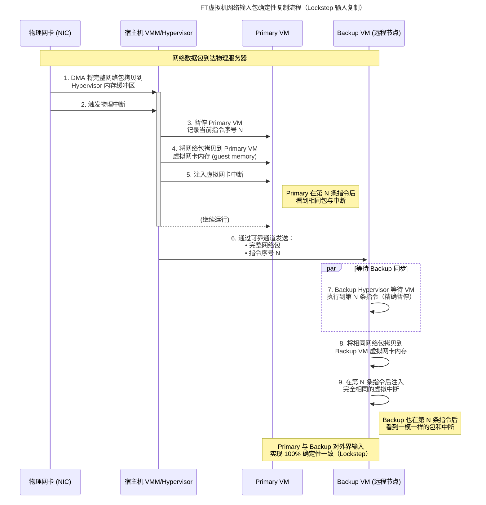

复制（Replication）
## 状态转移和复制状态机（State Transfer and Replicated State Machine）
**状态转移**：Primary将自己完整状态，比如说内存中的内容，拷贝并发送给Backup  
**复制状态机**：只会从Primary将外部事件，例如外部的输入，发送给Backup
- *基于事实*：我们想复制的大部分的服务或者计算机软件都有一些确定的内部操作，不确定的部分是外部的输入。  
*如果有两台计算机，如果它们从相同的状态开始，并且它们以相同的顺序，在相同的时间，看到了相同的输入，那么它们会一直互为副本，并且一直保持一致。***使用复制状态机而不是状态转移的原因**：
- 操作通常来说比较小，而状态通常比较大
> ？随机操作  
：Backup的VMM会探测这些指令，拦截并且不执行它们。VMM会让Backup虚机等待来自Log Channel的有关这些指令的指示，比如随机数生成器这样的指令，之后VMM会将Primary生成的随机数发送给Backup。
复制了什么：
- VM:复制机器的完整状态，这包括了所有的内存，所有的寄存器。这是一个非常非常详细的复制方案
- GFS:应用程序将数据抽象成Chunk和Chunk ID，GFS只是复制了这些
**同步流程**：  
lan-&gt;A-&gt;B\~(回复)&gt;A \  
\|-&gt; 客户 \  

> [原笔记中的截图：20251118163134.png]

  
将Primary到Backup之间同步的数据流的通道称之为Log Channel  
从Primary发往Backup的事件被称为Log Channel上的Log Event/Entry  
**故障**
1. Primary因为故障停止运行时，FT（Fault-Tolerance）就开始工作了。 \
2. 每个Primary的定时器中断都会生成一条Log条目并发送给Backup，这些定时器中断每秒大概会有100次由此可以判断P是否挂了。\
3. 当Backup不再从Primary收到消息，VMware FT论文的描述是，Backup虚机会上线（Go Alive）。这意味着，Backup不会再等待来自于Primary的Log Channel的事件，Backup的VMM会让Backup自由执行，而不是受来自于Primary的事件驱动。Backup的VMM会在网络中做一些处理（猜测是发GARP），让后续的客户端请求发往Backup虚机，而不是Primary虚机
4. Backup虚机接管了服务
## 非确定性（Non-Deterministic）事件
分为几类：
- 客户端输入
- 怪异指令：一些指令在不同的计算机上的行为是不一样的
  - 随机数生成器
  - 获取当前时间的指令，在不同时间调用会得到不同的结果
  - 获取计算机的唯一ID
- 多CPU的并发(论文未讨论)
Log struct(guess)
```plain text
insturction #(序号)
type
data

```
### Q&A
> ？同步时钟  
：在适当的时候，VMM会停止Primary虚机的指令执行，并记下当前的指令序号，然后在指令序号的位置插入伪造的模拟定时器中断，并恢复Primary虚机的运行。之后，VMM将指令序号和定时器中断再发送给Backup虚机。虽然Backup虚机的VMM也可以从自己的物理定时器接收中断，但是它并没有将这些物理定时器中断传递给Backup虚机的guest操作系统，而是直接忽略它们。当来自于Primary虚机的Log条目到达时，Backup虚机的VMM配合特殊的CPU特性支持，会使得物理服务器在相同的指令序号处产生一个定时器中断，之后VMM获取到这个中断，并伪造一个假的定时器中断，并将其送入Backup虚机的guest操作系统，并且这个定时器中断会出现在与Primary相同的指令序号位置（summary：伪造的定时器中断）
> ？Backup领先了Primary会怎么样？  
：维护一个来自于Primary的Log条目的等待缓冲区，如果缓冲区为空，Backup是不允许执行指令的。如果缓冲区不为空，那么它可以根据Log的信息知道Primary对应的指令序号，并且会强制Backup虚机最多执行指令到这个位置
### Bounce Buffer机制
针对网络请求，不同操作系统的操作可能不同，如果我们允许网卡直接将网络数据包DMA到Primary虚机中，我们就失去了对于Primary虚机的时序控制，因为我们也不知道什么时候Primary会收到网络数据包。
物理服务器的网卡会将网络数据包拷贝给VMM的内存，之后，网卡中断会送给VMM，并说，一个网络数据包送达了。这时，VMM会暂停Primary虚机，记住当前的指令序号，将整个网络数据包拷贝给Primary虚机的内存，之后模拟一个网卡中断发送给Primary虚机。同时，将网络数据包和指令序号发送给Backup。Backup虚机的VMM也会在对应的指令序号暂停Backup虚机，将网络数据包拷贝给Backup虚机，之后在相同的指令序号位置模拟一个网卡中断发送给Backup虚机

## 输出控制（Output Rule）
系统里唯一的输出是客户端的响应，但是只有Primary虚机才会真正的将回复送出，而Backup虚机只是将回复简单的丢弃掉。  \

A(11) -&gt; B(10) -&gt; before B take log(add 11): A die -&gt; B needed to be P -&gt; added to 11 \  
\|-&gt; 客户11                                                                                         ｜-&gt; 客 11  
自增两次返回11❌
### 控制输出的解决方案
直到Backup虚机确认收到了相应的Log条目，Primary虚机不允许生成任何输出  
流程：
1. 客户端输入到达Primary。
2. Primary的VMM将输入的拷贝发送给Backup虚机的VMM。所以有关输入的Log条目在Primary虚机生成输出之前，就发往了Backup。之后，这条Log条目通过网络发往Backup，但是过程中有可能丢失。
3. Primary的VMM将输入发送给Primary虚机，Primary虚机生成了输出。现在Primary虚机的里的数据已经变成了11，生成的输出也包含了11。但是VMM不会无条件转发这个输出给客户端。
4. Primary的VMM会等到之前的Log条目都被Backup虚机确认收到了才将输出转发给客户端。所以，包含了客户端输入的Log条目，会从Primary的VMM送到Backup的VMM，Backup的VMM不用等到Backup虚机实际执行这个输入，就会发送一个表明收到了这条Log的ACK报文给Primary的VMM。当Primary的VMM收到了这个ACK，才会将Primary虚机生成的输出转发到网络中。
**核心思想**：确保在客户端看到对于请求的响应时，Backup虚机一定也看到了对应的请求，或者说至少在Backup的VMM中缓存了这个请求
> ？由primary输入，backup输出（没有考虑过）
## 重复输出（duplicated output)
之前的 [[VMware FT#Bounce Buffer机制]]，backup有个log缓冲机制，当缓冲积压，并最后存在一个客户端请求，当消费这个的时候再向客户端返回，这又会出现双11  \  
but， 由于backup复制primary同样的TCP序列号，会在客户端丢弃，这就看不到重复
**对于任何有主从切换的复制系统，基本上不可能将系统设计成不产生重复输出**
如果没有TCP序列号，我们使用新的机制，或许是应用程序级别的序列号
> ？backup和primary的tcp ip为什么相同  
：以太网交换机会维护MAC地址表，表明MAC地址与交换机端口的对应，因为Primary和Backup虚机的MAC地址一样，当主从切换时，这个表需要更新，这样同一个目的MAC地址，切换前是发往了Primary虚机所在的物理服务器对应的交换机端口，切换之后是发往了Backup虚机所在的物理服务器对应的交换机端口（交换机更具MAC表发送，虚机MAC相同，发送IP相同）
## Test-and-Set 服务
同时让Primary和Backup都在线，那么我们现在就有了**脑裂（Split Brain）**
Test-and-Set作为中间仲裁，会在内存中保留一些标志位，当你向它发送一个Test-and-Set请求，它会设置标志位，并且返回旧的值。Primary和Backup都需要获取Test-and-Set标志位，这有点像一个锁。（CAS?)
